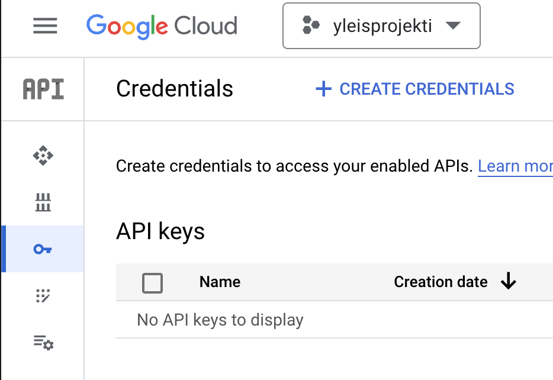
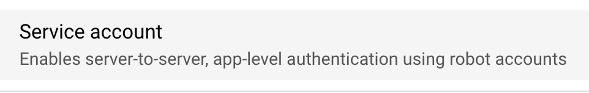
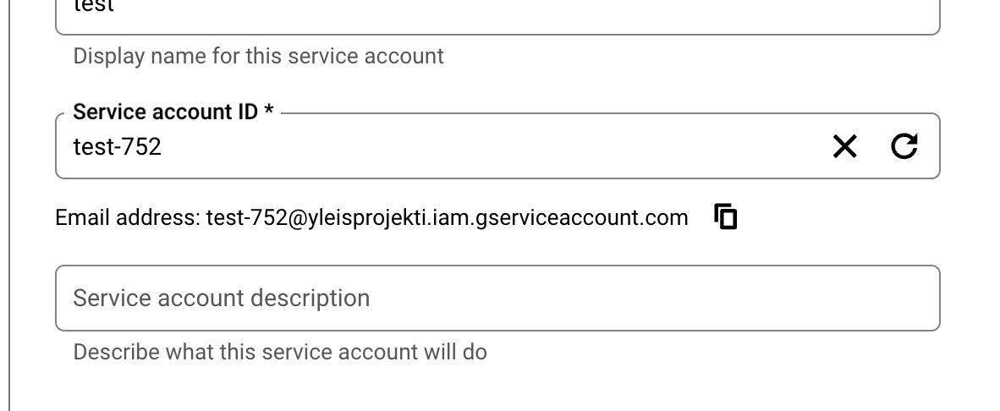
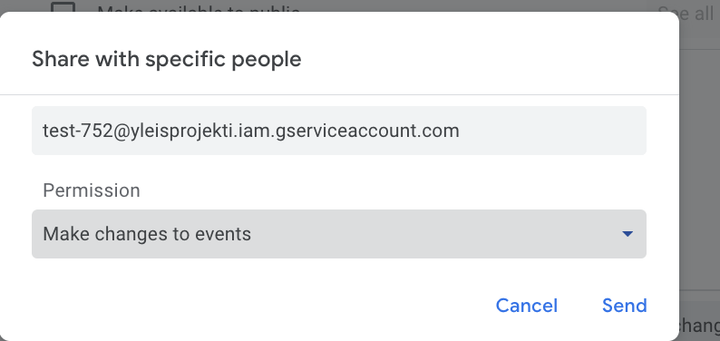

# Calendar sync from Outlook to Google

A script made for my personal needs while ago. For some reason, the outlook calendar doesn't sync with google calendar that well and I ended up missing some meetings because of that.

I needed a solution so I made this script that runs on a VPS somewhere on hourly basis using cron.

Feel free to grab this and refactor it to your needs.

### Requirements

- Python 3.12
- Pip
- Virtualenv
- Outlook account
  - A calendar share link from outlook
- Google account
- Google API credentials
  - You don't need to have a billing account for this. Just create a project in google cloud console and enable the calendar API.
  - Go to your console (create a project) and navigate to APIs & Services. Click *Create Credentials*

    
  - Use a service account for this
  - 
  - Create the account. Take note of the email address. Copy it and save it somewhere
  - 
  - **You don't need to give the account any permissions**
  - Save the credentials as cr.json inside the project folder root
  - Navigate to calendar.google.com and create a new calendar. Share the new calendar with the service account email.
  - 

### Usage

1. Clone the repo via
   ``git clone <repo_url> .``
2. Create a virtual environment

```
python3.12 -m venv venv
```

3. Activate the virtual environment

```
# Linux / Mac
source venv/bin/activate

# Windows
venv\Scripts\activate
```

4. Install the requirements
   ``python3 -m pip install -r requirements.txt``
